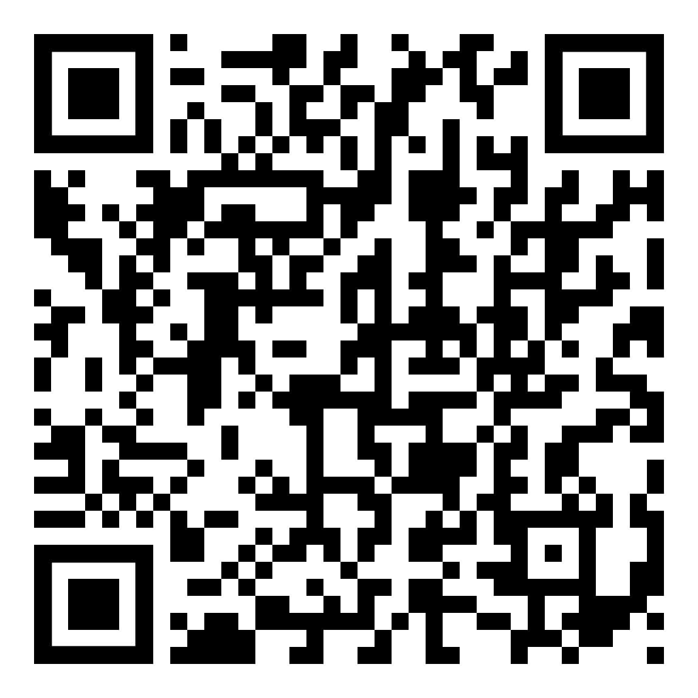

# Welcome
## Kansas City Philosophy Club
### October 2025

---

# Links

---

# Follow Along

---

# Goals and Process
- Minimize information and statements
- All info and statements should be viewed as premises
- Disagreement welcome
- Questions meant for Socratic dialog
- Discussion can drift, I will redirect if needed

---

## Discussion Guidelines

1. **Listen actively** - Seek to understand before responding
2. **Ask clarifying questions** - "What do you mean by...?"
3. **Challenge ideas, not people** - Focus on arguments, not character
4. **Acknowledge uncertainty** - "I'm not sure, but..."
5. **Find common ground** - Build on agreements
6. **Embrace disagreement** - It's how we learn

**"In Socratic dialogue, we are all students."**

---

## Our Central Question

### **Is it ethical and productive to culturally shame and censor people who promote extreme intolerance and oppression?**

---

## Today's Journey

1. Understanding Shame: Types, Functions, and Buddhist Perspectives
2. Exploring Censorship: Forms and Boundaries
3. Tolerance, Intolerance, and Oppression
4. Ethical Frameworks for Analysis
5. Ezra Klein's Perspective
6. Olúfẹ́mi O. Táíwò's Response
7. Synthesis and Discussion

---

# Part I: Understanding Shame

---

## What IS Shame?

**Richard Schweder's Minimal Definition:**
"Shame is the deeply felt and highly motivating experience of the fear of being judged defective—the anxious experience of either the real or anticipated loss of status, affection, or self-regard."

**Question for Discussion:** 
Does this definition resonate with your experience of shame?

---

## Shame vs. Guilt vs. Embarrassment

**Shame:** About WHO you are; affects your self-conception
"I am a bad person"
**Guilt:** About WHAT you did; specific to an action
"I did a bad thing"
**Embarrassment:** Temporary, low-grade shame; situational
"That was awkward"

**Discussion:** Have you experienced these differently? How?

---

## Types of Shame

1. **Individual/Personal Shame** - Private feelings about one's own actions
2. **Collective/Cultural Shame** - Shared shame about group membership/actions
3. **Toxic Shame** - Chronic, paralyzing shame that damages self-worth
4. **Moral Shame** - Appropriate response to ethical transgression

**Question:** Can shame ever be productive or "healthy"?

---

## Hiri and Ottapa: Buddhist "Healthy Shame"

**Hiri (हिरि):** 
- "Moral shame" or conscience
- Natural desire to show up with grace and care
- Self-respect; awareness of how actions impact others
- "The inner ick factor"

---

## Hiri and Ottapa: Buddhist "Healthy Shame"

**Ottapa (ओत्तप्प):**
- "Moral dread" or healthy embarrassment
- Understanding the impact on others
- Concern for reputation and relationships
- "Healthy worry about what others think"

---

## JoAnna Hardy on Hiri & Ottapa

From the 10% Happier podcast:

**Hiri:** "That real desire just for it all to go well... that understanding of knowing how you are impacts the other person. This was the word I was looking for: self-respect, conscience, instinct, your inner ick."

**Ottapa:** "That moment of understanding. I made a commitment to myself that I don't need to do that again, right? And that feels really good."

**Question:** Is this different from toxic shame? How?

---

## Buddhist Perspective: The "Bliss of Blamelessness"

**Dan Harris:** "If your mind isn't aflame ruminating upon all of the shabby ways in which you've treated other people... there's a lot more room for calm, quiet, creativity, all the good stuff."

**Key Insight:** Buddhist ethics aren't about moralizing—they're about making you happier.

**Discussion:** Can shame be a tool for self-improvement rather than self-destruction?

---

## Cultural Variations in Shame

**Richard Schweder's Research:**
- In Oriya Brahmin households (India), "lajja" (shame) is associated with: Unpretentious, reserved, self-restrained, humble, proper, civilized, self-effacing, decent, elegant
- In contemporary Anglo-American culture, shame is associated with: Meek, timid, bashful, mousy, sheepish, embarrassed, self-deprecating

**Question:** Does culture shape what we feel shame about? Or how we value shame?

---

## The Functions of Shame

**Positive Functions:**
- Social regulation and norm enforcement
- Encourages prosocial behavior
- Motivates moral development
- Protects community cohesion

---

## The Functions of Shame

**Negative Effects:**
- Can be paralyzing and destructive
- May lead to hiding/isolation rather than repair
- Can damage self-worth permanently
- May cause depression and anxiety

**Question:** When does shame cross from productive to destructive?

---

## Public Shaming vs. Private Shame

**Discussion Questions:**
1. Is there a difference between feeling personal shame and being publicly shamed by others?
2. Can public shaming lead to behavior change, or does it just drive behavior underground?
3. Who gets to decide what's shameful?

---

# Part II: Censorship

---

## What Is Censorship?

**Basic Definition:** The suppression or restriction of speech, public communication, or other information that may be considered objectionable, harmful, sensitive, or inconvenient.

**Key Question:** Who is doing the censoring, and by what authority?

---

## Types of Censorship

**1. Government/State Censorship**
- Legal prohibition of speech
- Backed by law enforcement/punishment
- Example: Banning books, criminalizing speech, **Jimmy Kimmel**

---

## Types of Censorship

**2. Institutional Censorship**
- Universities, workplaces, schools
- Rules about acceptable discourse
- Example: Academic codes of conduct, Military

---

## Types of Censorship

**3. Social/Cultural Censorship**
- Informal social pressure
- "Cancel culture" / boycotts
- Social consequences for speech

**Question:** Are these all equally problematic? Or are distinctions important?

---

## Example of "Cancel culture"
- Justine Sacco - public relations executive for the internet media company IAC 
- Posted this tweet in December 2013, right before boarding a flight to South Africa
> Going to Africa. Hope I don't get AIDS. Just kidding. I'm white!
- Tweet went viral while she was in the air, sparking global outrage. By the time she landed, she had become a worldwide trending topic, and her employer, IAC, had publicly condemned the statement and fired her

---

## Censoring People vs. Censoring Ideas

**Censoring Ideas:** Restricting the spread of specific beliefs or information

**Censoring People:** Silencing individuals through social exclusion, deplatforming, or punishment

**Discussion:** Is there a meaningful distinction? Can you censor an idea without censoring the person?

---

## The Marketplace of Ideas

**Traditional Liberal View:**
- Truth emerges from free and open debate
- Bad ideas should be defeated by better arguments, not suppression
- Sunlight is the best disinfectant

---

## The Marketplace of Ideas

**Critique:**
- Not all speech is equal in power/reach
- Some ideas actively harm vulnerable groups
- Marketplace assumes good-faith participants

**Question:** Does the marketplace of ideas work when some participants reject rational argument?

---

## The Martketplace of Ideas

> The history of print and witch-hunting indicates that an unregulated information market doesn't necessarily lead people to identify and correct their errors, because it may well prioritize outrage over truth. For truth to win, it is necessary to establish curation institutions that have the power to tilt the balance in favor of facts.
> —Yuval Noah Harari

**Question:** In an age of constant information (humans and AI), is the goal of a society to pursue Truth (objective reality) or Order (social harmony based on a shared, necessary fiction)?

---

## Self-Censorship

**Definition:** When individuals voluntarily suppress their own speech due to:
- Fear of social consequences
- Anticipation of punishment, backlash, or shame
- Desire to avoid conflict

**Questions:**
1. Is self-censorship always bad?
2. Or is it sometimes wisdom/discretion? How do we distinguish?

---

# Part III: Tolerance and Intolerance

---

## What Should We Tolerate?

**Core Question:** In a free society, what limits—if any—should exist on tolerance?

**Sub-questions:**
- Must we tolerate all beliefs equally?
- Must we tolerate all behaviors equally?
- Who decides what's intolerable?
- What do we mean by "tolerate"?

---

## The Paradox of Tolerance

**Karl Popper (1945):**

> Unlimited tolerance must lead to the disappearance of tolerance. If we extend unlimited tolerance even to those who are intolerant, if we are not prepared to defend a tolerant society against the onslaught of the intolerant, then the tolerant will be destroyed, and tolerance with them.

---

## Popper's Solution

> We should claim the **right** to suppress them if necessary even by force; for it may easily turn out that they are not prepared to meet us on the level of rational argument, but begin by denouncing all argument.

**BUT:**
> I do not imply that we should always suppress the utterance of intolerant philosophies; **as long as we can counter them by rational argument and keep them in check by public opinion, suppression would certainly be most unwise.**

---

## Popper's Solution

**Question:** 
- Where is the line between countering with argument vs. suppression?
- How does one definitively identify or define "intolerant philosophies" in a way that is objective and not simply a matter of political or moral disagreement?
- In a modern context dominated by social media and rapid disinformation, how does the effectiveness of "rational argument" and "public opinion" change, and does this lower the threshold for legitimate suppression?

---

## John Rawls on Tolerating the Intolerant

**Rawls's View (A Theory of Justice, 1971):**
- A just society must generally tolerate the intolerant
- **EXCEPT:** When intolerance poses concrete threat to liberty and security of the tolerant

"While an intolerant sect does not itself have title to complain of intolerance, its freedom should be restricted only when the tolerant sincerely and with reason believe that their own security and that of the institutions of liberty are in danger."

**Question:** How do we determine when that threshold is met?

---

## The Social Contract Approach

**Alternative Framework:**
- Tolerance is not a moral virtue but an **unspoken agreement**
- We tolerate each other's differences as long as **no harm arises**
- Intolerance **violates the contract**
- Those who violate are no longer protected by it

**Discussion:** Does this resolve the paradox? Or create new problems?

---

## Defining Oppression

**What counts as oppression?**
- Systematic disadvantage based on group membership?
- Physical violence or threat of violence?
- Denial of rights and opportunities?
- Cultural erasure?
- All of the above?

**Question:** Who gets to define what's oppressive?

---

## Tolerance vs. Acceptance

**"Tolerance"** implies:
- Disapproval but non-interference
- "I don't like it, but I'll allow it"
- Power differential (who "allows"?)

**"Acceptance"** implies:
- Recognition of legitimacy
- No judgment of inferiority
- Equality of status

**Question:** Is "tolerance" enough? Or is it a form of oppression itself?

---

# Part IV: Ethical Frameworks

---

## Why Ethical Frameworks Matter

Different ethical systems yield **different conclusions** about the same dilemma.

Understanding these frameworks helps us:
1. Articulate our own reasoning
2. Understand others' positions
3. Find common ground (or recognize irreconcilable differences)

---

## Consequentialism / Utilitarianism

**Core Principle:** The morality of an action is determined **solely by its consequences**

**Key Features:**
- Focus on outcomes, not intentions or character
- Seeks to maximize overall happiness/well-being
- "The greatest good for the greatest number"

---

## Consequentialism / Utilitarianism

**Applied to our question:**
- Does shaming reduce intolerant behavior?
- Does censorship prevent harm to vulnerable groups?
- Do the benefits outweigh the costs?

---

## Consequentialism: Strengths & Weaknesses

**Strengths:**
- Clear decision-making principle
- Focuses on tangible outcomes
- Pragmatic and flexible

---

## Consequentialism: Strengths & Weaknesses

**Weaknesses:**
- Difficult to predict all consequences
- May justify harmful means for good ends
- Ignores rights, justice, and individual dignity
- "Tyranny of the majority"

**Discussion:** Can you think of a case where good consequences justify shaming or censorship?

---

## Deontology (Duty Ethics)

**Core Principle:** Morality is based on **adherence to rules and duties**, regardless of consequences

**Key Features:**
- Certain actions are inherently right or wrong
- Universal moral rules (e.g., "don't lie," "respect autonomy")
- Focus on intentions and duties, not outcomes
- Associated with Immanuel Kant

---

## Deontology (Duty Ethics)

**Applied to our question:**
- Is censorship inherently wrong (violates free speech duty)?
- Is shaming inherently wrong (violates human dignity)?
- Do we have duties to protect vulnerable groups?

---

## Deontology: Strengths & Weaknesses

**Strengths:**
- Provides clear, universal rules
- Protects individual rights
- Values human dignity
- Not swayed by "ends justify means" thinking

---

## Deontology: Strengths & Weaknesses

**Weaknesses:**
- Rules can conflict (duty to protect vs. duty to allow speech)
- May seem rigid or impractical
- Doesn't account for context
- Who decides which rules are universal?

**Discussion:** Are there absolute moral rules about speech and shame?

---

## Virtue Ethics

**Core Principle:** Morality is about **character** and what a virtuous person would do

**Key Features:**
- Focus on the agent, not the act or consequences
- Cultivate virtues: courage, justice, wisdom, compassion
- Ask: "What would a person of good character do?"
- Associated with Aristotle

---

## Virtue Ethics

**Applied to our question:**
- Does shaming reflect virtuous character (justice?) or vice (cruelty?)
- What virtues are needed: courage to confront? Compassion? Wisdom to discern?
- What would a person of practical wisdom do in this situation?

---

## Virtue Ethics: Strengths & Weaknesses

**Strengths:**
- Acknowledges moral complexity
- Emphasizes character development
- Flexible and context-sensitive
- Focuses on human flourishing

---

## Virtue Ethics: Strengths & Weaknesses

**Weaknesses:**
- Less clear guidance for specific dilemmas
- Virtues can conflict (justice vs. mercy)
- Lists of virtues vary across cultures
- Requires moral exemplars (who?)

**Discussion:** What virtues are needed when confronting intolerance?

---

## Comparing Frameworks: A Scenario

**Scenario:** A speaker promotes views that dehumanize a minority group. Should they be:
1. Allowed to speak freely?
2. Publicly shamed/criticized?
3. Deplatformed/censored?

**Consequentialist asks:** What outcome produces the most good?
**Deontologist asks:** What duties/rights are at stake?
**Virtue ethicist asks:** What would a wise, just, compassionate person do?

---

## Other Frameworks and Comparisons

- Are there other frameworks we should consider?
- Which framework resonates most with you? Why?

---

# Part V: Contemporary Debates

---

### Ezra Klein
#### Charlie Kirk Was Practicing Politics the Right Way

> The foundation of a free society is the ability to participate in politics without fear of violence. To lose that is to risk losing everything.

- Examples of recent political violence: Gretchen Whitmer, Jan 6th, Paul & Nancy Pelosi, President Trump attempt assassination, Josh Shapiro, and Melissa Hortman.

---

### Ezra Kelin

> You can dislike much of what Kirk believed and the following statement is still true: Kirk was practicing politics in exactly the right way. He was showing up to campuses and talking with anyone who would talk to him.

> A taste for disagreement is a virtue in a democracy. Liberalism could use more of his moxie and fearlessness.

> two forms of reaction that are misguided [...] One is a move on the left to wrap Kirk’s death around his views [...] on the right, to turn his murder into a justification for an all-out war

---

### Ezra Klein

> Political violence is a virus. It is contagious. [...] When political violence becomes imaginable, either as a tool of politics or a ladder for fame, it begins to infect hosts heedlessly.

> Political violence imperils [the idea] that [...] both sides are meant to be on the same side of a larger project [...] trying to maintain the viability of the American experiment

> Kirk [was] on the same side on the continued possibility of American politics

---

### Ezra Klein
#### We Are Going to Have to Live Here With One Another

> [People on the left who were] infuriated by [my piece] offered the worst things Kirk had said and done: starting a watchlist of leftist professors, busing people to the protest that led to the Jan. 6 insurrection, telling his political foes that they should be deported, saying the Democratic Party hates this country, saying the Civil Rights Act was a mistake.

> We have to be able to see that the bullet that tore into him was an act of violence against us all.

---

### Ezra Klein

> The stakes of our politics right now are frightening; the consequences are real. We see one another as threats — and to some degree, we are right.

> We are going to have to live here with one another. There will be no fever that breaks, no permanent victory that routs or quiets those who disagree with us. I have watched many on both sides entertain the illusion that there would be, either through the power of social shame and cultural pressure or the force the state could bring to bear on those it seeks to silence. It won’t work. It can’t work. It would not be better if it did. That would not be a free country.

---

### Ezra Klein

> I think we also have to be looking for what we can recognize in one another. Sometimes that might mean overlooking what we can’t recognize in one another.

> I want to create a space that takes our disagreements seriously and takes the stakes of them seriously — but does so without deepening our divisions irreparably. We are going to have to live here with one another.

---

### Olúfẹ́mi O. Táíwò
#### How Can We Live Together?

> Bertrand Russell received a series of letters from Sir Oswald Mosley, the founder of the British Union of Fascists, inviting him to a debate

> Russell not only declined the invitation but replied quite generally that “nothing fruitful or sincere could ever emerge from association between us”—since “every ounce of my energy has been devoted to an active opposition to cruel bigotry, compulsive violence, and the sadistic persecution which has characterized the philosophy and practice of fascism.”

---

### Olúfẹ́mi O. Táíwò

> Whatever noun we use to label the “cruel bigotry, compulsive violence, and the sadistic persecution” of our day, we are confronted with a set of choices about what and whom to associate with that are not entirely different from the ones Russell confronted.

> the appeal to debate as “persuasion,” which confuses the mere appearance of giving and responding to reasons with the substance of good-faith rational inquiry

---

### Olúfẹ́mi O. Táíwò

> the watchlist Kirk spearheaded generated death threats, along with other evidence that would complicate the narrative that Kirk did politics the “right way”

> [Klein] contends that living with one another on the basis of “social shame and cultural pressure” cannot work and would not be worthwhile if it did: a nation where such things flourished would not be “a free country.”

---

### Olúfẹ́mi O. Táíwò

> What could Klein possibly mean by this? We already have been [living with each other] for quite some time, and doing so has not required revisionist history of the sort we are now witnessing about one Charles James Kirk in particular.

> A key aspect of the way we lived with each other [...] involved exactly the “social shame and cultural pressure” that Klein and other influential voices now come to condemn: “political correctness” as it was known in earlier days, or “wokeness” as it has come to be rebranded in recent years.

---

### Olúfẹ́mi O. Táíwò

> “PC culture” did indeed involve the shame and pressure Klein decries: a moral etiquette that directed people on how to avoid offense and stigmatized those who did not play by its rules

> The norms of political correctness thus set basic ground rules for social life—at least, in politically mixed company.

---

### Olúfẹ́mi O. Táíwò

> The challenge for Klein and his fellow travelers is to specify what sort of ground rules *could* make life livable and social situations manageable for such a wide array of people whose values, commitments, and interests differ so sharply [...] if not precisely “social shame and cultural pressure,” now contemptuously referred to as “political correctness” or “wokeness.” We might more accurately call it *exactly* the “civility” that centrists like Klein otherwise pretend to champion [...] These [are] the bare minimum for us to exist peacefully as profoundly different people who nevertheless share the same time and place.

---

### Olúfẹ́mi O. Táíwò

> Common decency, then, stigmatizes people that do not participate in it—removes them from voluntary association, as Russell exemplified. We indeed have to live with one another, but terms and conditions apply.

> This arrangement certainly risks some measure of injustice, inaccuracy, and overreach: a careless joke or comment here or there need not a bigot, much less a dyed-in-the-wool fascist, make. But admitting such possibilities, seeing this kind of basic social norm enforcement as fundamentally at odds with living in a free country is deeply delusional.

---

### Olúfẹ́mi O. Táíwò

> Deciding the level of intimacy with which you will live with the people around you is an utterly mundane part of living in the world—yes, even a free world—and doing so on the basis of other people’s character and conduct informs those decisions for anyone with values that stretch beyond those of cynical self-protection and into the territory of things like “basic self-respect,” “respect for others,” and “basic integrity.”

---

### Olúfẹ́mi O. Táíwò

> The point is that the possibility of overreach is a price worth paying exactly because shame serves as a robustly liberal alternative to the political violence that Klein and company rightly abhor. It is, quite literally, the least one can do to ensure rules of social conduct that upheld minimal levels of dignity for all involved. Most of the alternatives involve either subjugation, combat, or both. Put another way: designating disrespect and denigration as beyond the pale, as grounds for exclusion from polite company, *is* “turning the temperature down.” Klein and others are helping to turn it up.

---

### Olúfẹ́mi O. Táíwò

> We do need the core aspect of [90's PC culture and 2010's social justice culture] that makes Klein so uncomfortable: Russell’s expectation that those who relate to others as though they are not worthy of respect ought to be treated with the regard that orientation deserves.

> Very few of us are moral saints. Our values and principles ask more than most of us are able to give—if they don’t, they are probably too weak to be worth holding. But we don’t have to celebrate our failures or, worse still, confuse them with our successes. 

---

### Olúfẹ́mi O. Táíwò

> This is one valuable function of shame: it reminds us of who we want to be when we fall short, a goalpost that is necessarily anchored to the lofty height that our conduct fell beneath. We also encourage and defend these general social standards when we hold others to them, and not just ourselves.

---

# Part VI: Synthesis and Discussion

---

## Bringing It Together

Is it ethical and productive to culturally shame and censor people who promote extreme intolerance and oppression?

**We've explored:**
- Nature and functions of shame (individual, cultural, healthy, toxic)
- Various forms of censorship (government, institutional, social)
- The paradox of tolerance and limits of tolerance
- Ethical frameworks (consequentialism, deontology, virtue ethics)
- Contemporary debates

---

## Key Tensions

1. **Freedom vs. Protection**
   - Right to free speech vs. protection from harm

2. **Individual vs. Collective**
   - Individual rights vs. community welfare

3. **Principle vs. Pragmatism**
   - Absolute values vs. practical outcomes

4. **Short-term vs. Long-term**
   - Immediate silencing vs. long-term social change

---

## Questions for Socratic Dialogue

**On Effectiveness:**
1. Does shaming actually change minds, or does it entrench positions?
2. Does censorship reduce harmful speech, or drive it underground?
3. What evidence would convince you either way?

---

## Questions for Socratic Dialogue (cont'd)

**On Ethics:**
4. Can the means (shaming, censorship) be ethical if the ends (reducing oppression) are good?
5. Who gets to decide what speech is "intolerant enough" to warrant shame or censorship?
6. Is there a difference between government censorship and social consequences?

---

## Questions for Socratic Dialogue (cont'd)

**On Alternatives:**
7. What alternatives exist to shaming and censorship?
8. Is "more speech" always the answer? When is it not?
9. Can we distinguish between:
   - Criticizing ideas vs. shaming people?
   - Deplatforming vs. dialogue?
   - Accountability vs. cruelty?

---

## The Role of Hiri & Ottapa in Public Discourse

**Could "healthy shame" work at a cultural level?**

**Hiri:** Collective conscience about how we treat each other
**Ottapa:** Understanding the impact of our words and actions on others

**Discussion:** 
- Is there a difference between *feeling* shame about harmful speech and being *publicly shamed* by others?
- Can communities cultivate healthy shame without weaponizing toxic shame?

---

## The Paradox Revisited

**Popper's insight:**
- We must defend tolerance, but **wisely**
- Counter intolerance with rational argument **first**
- Reserve suppression for those who reject rational argument **and** threaten liberty

**But:** How do we know when rational argument has failed?
Who decides when the threat is real enough?
Can this principle be applied consistently and fairly?

---

## Finding Common Ground

**Possible points of agreement:**
1. Both tolerance and its limits matter
2. Context matters (difference between debate and incitement)
3. Methods matter (education vs. punishment)
4. Outcomes matter (both short-term and long-term)
5. Dignity matters (both for vulnerable groups and for those we oppose)

**Question:** What else might we agree on?

---

## Practical Scenarios for Discussion

**Scenario 1:** University speaker promotes discredited theories about racial intelligence. Should the university:
- Allow the speech?
- Allow but organize protests?
- Cancel the speech?

---

## Practical Scenarios for Discussion

**Scenario 2:** Public figure makes dehumanizing comments about LGBTQ+ people. Should there be:
- No consequences (free speech)?
- Social criticism and boycotts?
- Professional consequences (firing)?

---

## Scenario 3

A community member consistently shares conspiracy theories that incite violence against immigrants. The community response options:
1. Engage in dialogue
2. Socially ostracize them
3. Report to authorities
4. Organize counter-education campaigns
5. All of the above?
6. Something else?

**Discussion:** Apply different ethical frameworks to this scenario.

---

## Personal Reflection Questions

1. When have you felt shamed? Was it productive or harmful?
2. When have you shamed others? What was your intention? What was the result?
3. What speech do you think should have consequences? Why?
4. Where do you draw your personal line on tolerance?
5. Has this discussion changed your thinking? How?

---

## Moving Forward

**Instead of "Should we shame and censor?"**

**Perhaps better questions:**
1. How can we effectively challenge harmful speech while respecting human dignity?
2. What does accountability look like without cruelty?
3. How do we protect vulnerable groups while preserving open discourse?
4. What role do I personally play in cultivating the culture I want to see?

---

## Final Thoughts

**From the Buddhist tradition:**
- Ethics are about reducing suffering
- Compassion includes those we oppose
- Wisdom requires discernment, not dogma
- The path is long; mistakes are part of learning

---

## Final Thoughts

**From Popper:**
- Defend tolerance vigorously
- Use rational argument first
- Reserve force as last resort

---

## Final Thoughts

**From Schweder:**
- Culture shapes our moral emotions
- There is no view from nowhere
- Humility in our judgments

---

## Closing Question

**For reflection and discussion:**

**"What kind of community do we want to be?**
**One that tolerates intolerance?**
**One that shames and censors?**
**Or something else entirely?"**

---

## Thank You

**Questions for Open Discussion?**

Remember: The goal is not to reach consensus, but to understand deeply, question thoughtfully, and engage respectfully.

**"The unexamined life is not worth living." — Socrates**

---

## Further Resources

**Podcasts:**
- 10% Happier with Dan Harris: "Is There Such a Thing as Healthy Shame?" (JoAnna Hardy)
- Very Bad Wizards: "For Shame" (Richard Schweder's work)

---

**Reading:**
- Karl Popper, *The Open Society and Its Enemies* (1945)
- John Rawls, *A Theory of Justice* (1971)
- Richard Schweder, "Toward a Deep Cultural Psychology of Shame" (2003)

---

**Articles:**
- Ezra Klein, NYT Opinion (Sept 2025)
- Olúfẹ́mi O. Táíwò, "How Can We Live Together?" (Boston Review)

